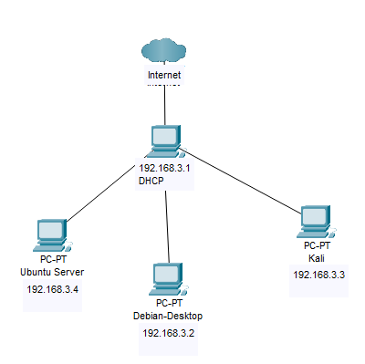

# Virtual HomeLab
I've always wanted to make a HomeLab, but finding and affording physical devices can be difficult. Until I get that opportunity, I am running a Virtual HomeLab by running multiple Virtual Machines on my Desktop and have created a LAN Network of servers communicating with each other. Below are the details of each machine and my plans for the future. 

## Current Set Up
This lab consists of 4 virtual machines (VMs): CentOS, Debian, Ubuntu, and Kali Linux, each tailored for specific roles within our network architecture. The CentOS VM acts as the central hub and router, providing both local network connectivity to the Debian and Kali VMs and managing external internet access via its NAT-configured network adapter. The Debian VM is set up for the development and testing of software projects, while the Kali Linux VM is dedicated to security testing and penetration exercises. Recently, the Ubuntu Server was added to use more services.

## Machine Specific Details 
Below are some details on the VMs I currently have running. For more details check out my [Event Log](Event-Log.md)

### CentOS
The CentOS machine is the only one with access to the internet. It is essentially working as a router by forwarding all traffic to the other machines.

  __Services__
- DHCP Server (online)

### Debian
I have never used Debian before, so I am still learning a lot about this one, with that being said, it soon will be hosting a few services.
__Services__
- Database (in progress)

### Ubuntu Server
I plan to use Ubuntu to manage a variety of services 
__Services__
- DNS (online)
- Web Server (online)

### Kali
My goal is to work at a SOC company, or anything related to Cyber Security, so using Kali is fun for testing out tools and trying new things.
